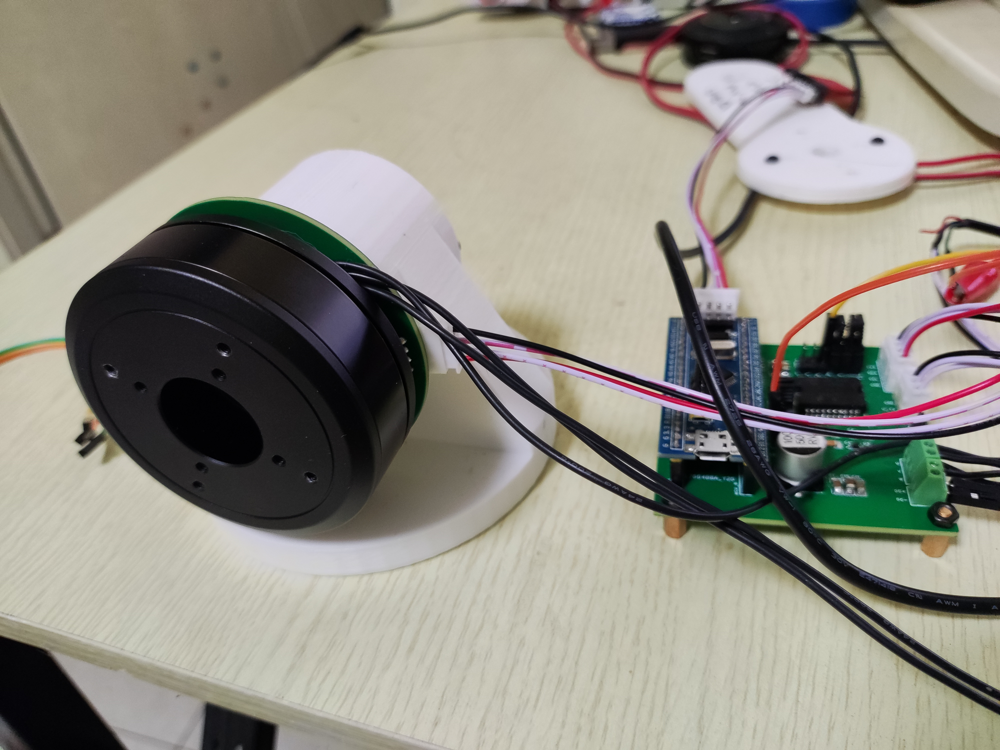

# FOC细节系列笔记1：开环控制的实现、验证和优化

## 0.前言

如本人[年记](https://zhuanlan.zhihu.com/p/581316474)中所说的，今年开始做自研软硬件的BLDC控制，近期终于实现了基本的FOC三环控制功能。但实际上控制带宽、稳态误差以及其他指标都还在一个非常大乃至无法使用的量级。于是决定一边优化性能，一边开始慢慢整理一个FOC系列笔记。随着电机控制这一行业的热度越来越高，其实网上相关FOC的优秀资料已经非常多了，所以这一系列笔记不打算再说明任何数学和工程原理，只用于记录我在实际工程应用中遇到的问题和解决方案。

如果你还不知道FOC是什么，建议先参考一些大佬的入门教程，下面给出我认为比较优秀的几篇：

- [b站\_热心市民翔先生\_电机FOC软硬件一条龙服务](https://www.bilibili.com/video/BV1uS4y1M7cv/?spm_id_from=333.999.0.0&vd_source=fdee23b968368d1c691892a805f5d95e)：我入门就是跟着他学的，讲的非常浅显易懂，软件硬件都教给你了
- [CSDN_zheng是在下_FOC入门教程](https://blog.csdn.net/qq_35947329/article/details/115483413?ops_request_misc=%257B%2522request%255Fid%2522%253A%2522166842908116782425618312%2522%252C%2522scm%2522%253A%252220140713.130102334..%2522%257D&request_id=166842908116782425618312&biz_id=0&utm_medium=distribute.pc_search_result.none-task-blog-2~all~top_positive~default-1-115483413-null-null.142^v63^control,201^v3^control_2,213^v2^t3_esquery_v1&utm_term=FOC&spm=1018.2226.3001.4449)：原理解释的非常清楚，而且也最后说到了如何软件实现
- [知乎\_稚晖\_深入浅出讲解FOC算法与SVPWM技术](https://zhuanlan.zhihu.com/p/147659820)：稚晖君写的入门教程，用通俗易懂的语言解释了FOC和SVPWM
- [SimpleFOC](http://simplefoc.cn/#/)：最简单的实现BLDC控制的方法，作者灯哥开源提供了官网的汉化。但需要注意SimpleFOC和FOC还是有一定区别的

**如果你也在将纸面上的理论转换成MCU里的C代码时遇到了困难，那么这一系列笔记也许会适合你。**珠玉在前，如果我的笔记能在读者的开发过程中，成为对上述文章的一点补充和参考，那将是我很大的荣幸。

## 1.软硬件平台简介

首先对本人实现FOC的软硬件平台作简要说明：

- 主控MCU：STM32F103C8T6（直接可以用BluePill最小板）
- 电机：脉塔智能GB6010（因为我想用于后续机器人的研究，选了一款额定力矩相对大的电机）
- 其他的主要硬件：自制的[驱动板](https://oshwhub.com/yuhao.zeng/drive_foc_l6234pd_ina240)和[编码器](https://oshwhub.com/yuhao.zeng/zhuan-gan-_ci-bian-ma-qi-_AS5600)板卡，配合BluePill使用。编码器:AS5600，驱动:L6234PD，电流采样：INA240A2
- 软件SDK：众所周知的Keil，配套STM32CUBEMX，所以语言当然是用HAL库了

硬件大概如下图：



软件实现功能的第一代版本：[FOC_V1](https://github.com/roboticszeng/GIA_ZENG)

## 2.FOC核心算法：SVPWM的实现、验证和优化

严格地说，SVPWM并不算是一种算法，应该类似于一种DC-AC变频技术。其输入是电机的Q轴电压`Uq`（可以类比直流电机的正负极压差）、D轴电压`Ud`（让电机发热的损耗电压）和电机的电角度`angle_el`（本节不讨论）；输出是三段PWM波分别通过驱动芯片放大后接入电机的UVW三相，从而驱动电机旋转。SVPWM实现的代码可以参考 [FOC_Kernal_3.c](https://github.com/roboticszeng/GIA_ZENG/blob/main/Software/FOC_V1_Software/Core/Src/FOC_kernal_3.c)，在文章中仅提供接口函数：

```
void setPhaseVoltage(float Uq, float Ud, float angle_el);
```

为了更好地解耦算法和传感，开环控制时令`angle_el`为一缓慢自增的浮点数，`Uq=6`,`Ud=0`为定值，直接在`main`函数中调用这一接口，并用某个IO口置位来观察计算速度，其代码如下：

