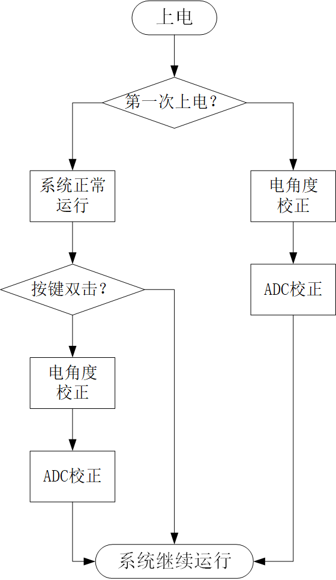

# GIA_ZENG开发文档

| 更新时间  | 版本号 | 更新内容   | 负责人       |
| --------- | ------ | ---------- | ------------ |
| 2023.1.21 | V0.2   | 初始化文档 | RoboticsZeng |

## 1.结构设计

==Reserve==

## 2.硬件设计

==Reserve==

## 3.软件设计

GIA_ZENG软件层按照应用功能主要分为以下几部分：FOC控制、自标定、数据存储和对外通讯，其中包含相关驱动的开发和数值解算。下面分别详细说明。

### 3.1 FOC控制

FOC控制是BLDC驱动的核心功能，其流程如下图所示：

==缺一张网图==

上述功能主要依赖以下算法：SVPWM计算、位置速度估计、电流估计、PI控制器、滤波器。另外需要相应的硬件驱动开发。

#### 3.1.1 SVPWM计算

GIA_ZENG采用的是有感FOC，故电角度为已知量，首先进行反park变换：
$$
U_{\alpha} = U_d\cos q_e + U_q\sin q_e
$$

$$
U_{\beta}=U_d\sin q_e + U_q\cos q_e
$$

==Reserve==

#### 3.1.2 位置速度估计

AS5600可以直接获得12位绝对位置，通过单位转换函数`convert_pulse_to_angle`转换为角度，单位rad。

速度采用M法进行估计，如下式：
$$
v=(p-p_{prev})/T
$$
其中，$p$为当前时刻位置，单位rad；

$p_{prev}$为上一时刻位置，单位rad；

$T$为编码器采样时间，单位s；

$v$为估计速度值，单位rad/s。

#### 3.1.3 电流估计

INA240可以直接通过12位ADC获得两相电压值，进行校正后再通过单位转换函数`convert_pulse_to_current`转换为电流，单位A。进一步计算q轴和d轴的方式如下：

（1）Clarke变换到$I_{\alpha}, I_{\beta}$
$$
I_{\alpha}=I_a
$$

$$
I_{\beta} = \frac{\sqrt{3}}{3}(I_a+2I_b)
$$

（2）Park变换到$I_q,I_d$
$$
I_d=I_{\alpha}\cos q_e + I_{\beta}\sin q_e
$$

$$
I_q=-I_{\alpha}\sin q_e + I_{\beta}\cos q_e
$$

#### 3.1.3 PI控制器

本方案采用抗积分饱和的离散PID控制器，其逻辑如下：

PI控制器算法逻辑不再赘述。

#### 3.1.4 低通滤波器

本方案对速度、q轴电流和d轴电流计算时采用了一阶低通滤波器，其s域表达为：
$$
G(s) = \frac{1}{\frac{s}{2\pi f_c} + 1}
$$
其中，$f_c$为数字截止频率。

向后差分到z域再写成差分方程：
$$
y(n)=\frac{RC}{T_s+RC}y(n-1)+\frac{T_s}{T_s+RC}x(n)
$$
其中，$T_s$为采样时间，$RC=\frac{1}{2\pi f_c}$

#### ==3.1.5 展望==

- 加入数字截止频率到模拟截止频率的转换
- 改为二阶butterworth滤波器
- 向后差分改成tustin

### 3.2 电角度&ADC校正

本方案对电角度和ADC偏置量采用了自动和手动校正的方法，具体步骤如下：

#### 3.2.1 电角度校正

设置开环SVPWM控制如下：

| $U_q$ | $U_d$ | $q_e$ |
| ----- | ----- | ----- |
| 0.5   | 0.0   | 0.0   |

注意此处的$U_q,U_d$为相对供电电压的相对值，取值范围$[-1,1]$

循环设置N次上述电角度对正，同时通过编码器读取当前位置，求平均值得到校正的电角度，作为单位转换函数`compute_position_elec`的配置项。

#### 3.2.2 ADC校正

设置控制模式为MODE_NO确保驱动器未使能，当前电流为零，循环采集N次此时刻的ADC值，求平均值得到校正的ADC偏置量，在ADC采样时作为输入。注意由于INA240芯片易损坏，此处需要手动check偏置量是否正确，即观察偏置值是否在2048附近。

#### ==3.2.3 展望==

- 校正时需要加入合理的小灯闪烁来指示正在校正
- 加入ADC求偏置的单位转换函数，不要直接写在ADC采样内

### 3.3 CAN通讯

本方案当前仅采用了CAN通讯与其他MCU或上位机交互数据，同时USART用于打印调试信息。文档中仅介绍CAN通讯。CAN读写均采用扩展数据帧形式，数据形式定义为PDO（循环上报）和SDO（根据指令上报）。

#### 3.3.1 CAN读取

（1）PDO

PDO数据循环上报，无需读取，其数据格式为：

| data[0] | data[1] | data[2]      | data[3]      | data[4]      | data[5]      | data[6]      | data[7]      |
| ------- | ------- | ------------ | ------------ | ------------ | ------------ | ------------ | ------------ |
| mode_h  | mode_l  | actual_pos_h | actual_pos_l | actual_vel_h | actual_vel_l | actual_cur_h | actual_cur_l |

其中，\*\_h和\*\_l分别为*的高八位和低八位。其具体数值和单位转换的方式参考附录。

（2）SDO

读取数据格式为：

| data[0] | data[1] | data[2] | data[3] | data[4] | data[5] | data[6] | data[7] |
| ------- | ------- | ------- | ------- | ------- | ------- | ------- | ------- |
| 0x56    | id*     | Reserve | Reserve | Reserve | Reserve | 0x0d**  | 0x0a    |

*：id为当前关节的id号，默认为0x00

**：推荐的值，当前程序还没有设置check这一位

软件在收到数据头为0x56的CAN数据包后开始解析，将当前CAN地址下的SDO数据返回。

#### 3.3.2 CAN写入

PDO和SDO的写入逻辑相同，均是在软件内重构了CAN_RX中断，读取的数据格式为：

| data[0] | data[1] | data[2] | data[3] | data[4] | data[5] | data[6] | data[7] |
| ------- | ------- | ------- | ------- | ------- | ------- | ------- | ------- |
| 0x55    | id      | data_h  | data_l  | Reserve | Reserve | 0x0d    | 0x0a    |

软件在收到数据头为0x55的CAN数据包后开始解析，将当前CAN地址下的PDO或SDO数据写入控制器。

#### 3.3.3 PDO/SDO转换

上位机向控制器发送PDO/SDO后，还需要将这一`uint16_t`类型的标准参数转换为实际使用的配置值或控制目标值，这一逻辑较复杂，具体分为以下几种情况：

（1）收到的数据是PDO：MODE_OF_OPERATION, TARGET_POSITION, TARGET_VELOCITY, TARGET_CURRENT

- STEP1: 解析地址，将收到的数据存入PDO结构体的指定成员中。
- STEP2: 由下式转化为State结构体的指定成员。

$$
State=256*PDO_h+PDO_l
$$

- STEP3: FOC三环控制的定时器中断中只调用State成员的变量进行实时控制，而不考虑PDO的问题

（2）收到的数据是除上述之外的PDO：无意义，不作响应

（3）收到的数据是SDO，但不是`SDO->ID`或`SDO->SAVE_FLASH`

- STEP1: 解析地址，将收到的数据存入`SDO->SDO_ID`
- STEP2: 调用函数`para_init`初始化所有config参数

`para_init`函数包括：

#### ==3.3.4 展望==

- CAN回传PDO时只用了一个邮箱传输了部分数据，这是由于邮箱容易被占用阻塞，后续应解决这一问题

### 3.4 配置读写和存储

配置读写和存储的逻辑较为复杂，具体的涉及到以下几个方面：CAN通讯收到的PDO/SDO数据转换为实际使用的配置值或控制目标值；上电时的配置读取逻辑；基于内部FLASH的数据存储逻辑。下面分别叙述。

#### 3.4.1 PDO/SDO的转换

#### 3.4.2 配置参数读取

#### 3.4.3 配置参数存储

### 3.5 依赖硬件的说明

本文档中对硬件驱动的详细逻辑不再赘述，仅给出依赖硬件驱动的说明。

STM32CUBEMX引脚总览：

| 引脚 | 名称      | 备注                           |
| ---- | --------- | ------------------------------ |
| PA0  | ADC1_IN0  |                                |
| PA1  | ADC1_IN1  |                                |
| PA2  | USART2_TX |                                |
| PA3  | USART2_RX |                                |
| PA4  | SEN_DIR   | 编码器方向定义                 |
| PA5  | KEY       | 按键输入，软件暂未实现         |
| PA8  | TIM1_CH1  | PWM-U相输出                    |
| PA9  | TIM1_CH2  | PWM-V相输出                    |
| PA10 | TIM1_CH3  | PWM-W相输出                    |
| PA11 | CAN_RX    |                                |
| PA12 | CAN_TX    |                                |
| PB5  | SENS_OUT  | 编码器电压输出（当前版本不用） |
| PB6  | I2C1_SCL  | 编码器I2C通信                  |
| PB7  | I2C1_SDA  | 编码器I2C通信                  |
| PC13 | LED       |                                |

#### 3.5.1 定时器中断

本方案中采用了四个定时器中断如下：

| 定时器 | 分频值PSC | 重装值ARR | 周期T   | 频率f    | 功能简介                        |
| ------ | --------- | --------- | ------- | -------- | ------------------------------- |
| TIM1   | 2-1       | 1500-1    | 41.67us | 24kHz    | 生成PWM波&电流采样&电流滤波     |
| TIM2   | 300-1     | 240-1     | 1ms     | 1000Hz   | 编码器采样&速度估计滤波&CAN上报 |
| TIM3   | 160-1     | 72-1      | 160us   | 6.25kHz  | 计算SVPWM&电流环PI控制          |
| TIM4   | 160-1     | 144-1     | 320us   | 3.125kHz | 位置环&速度环PI控制             |

注：定时器分频、重装值和周期/频率的转换关系如下：

公式：
$$
T=(ARR+1)*(PSC+1)/f_{ck}
$$

$$
f=\frac{1}{T}
$$

$f_{ck}$为主频，单位Hz。对于STM32F103C8T6，$f_{ck}=72\times10^6$Hz；$T$单位为s。

#### 3.5.2 I2C通讯

编码器AS5600通过I2C与主控制器通信，模式Fast Mode，通信速率400kHz

#### 3.5.3 ADC读取

主控制器通过ADC1双通道IN0和IN1读取两片INA240的电压，采用DMA方式。

#### 3.5.4 按键外部中断

设置PA5引脚为GPIO_EXTI5，EXTI_line[9:5] interrupt中断优先级5，注意此处必须设置System Ticker Timer优先级小于5，否则可能会在中断处卡住。

本方案对按键中断设计了单击、双击、长按三个事件，其功能如下：

| 事件        | 功能                |
| ----------- | ------------------- |
| 单击        | 指示灯电平翻转      |
| 双击        | 手动电角度&ADC校正  |
| 长按（>1s） | 存储数据到内部FLASH |

#### 3.5.5 CAN通讯

#### 3.5.6 内部FLASH

## 4.附录

### 4.1 单位转换

### 4.2 通讯协议详解

