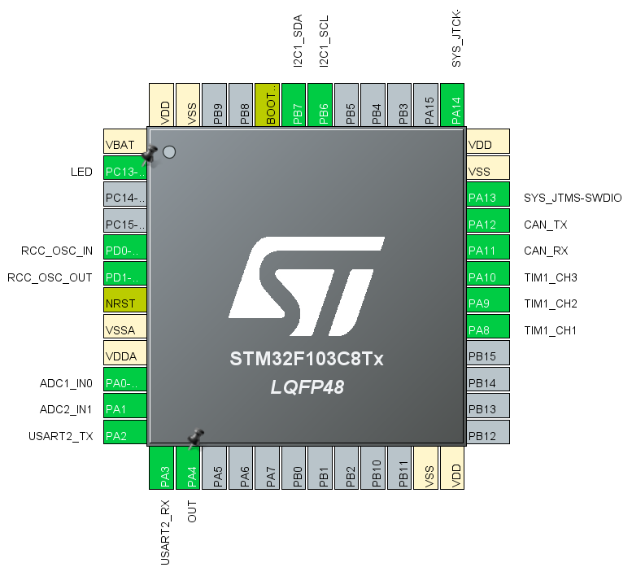
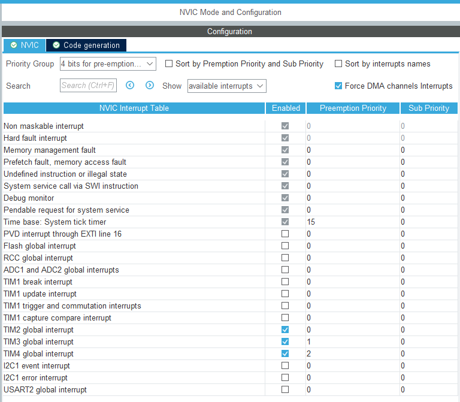
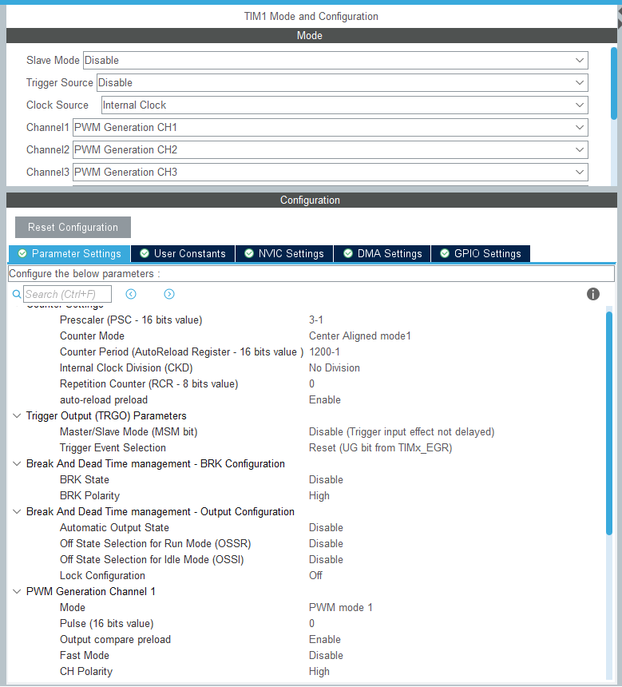
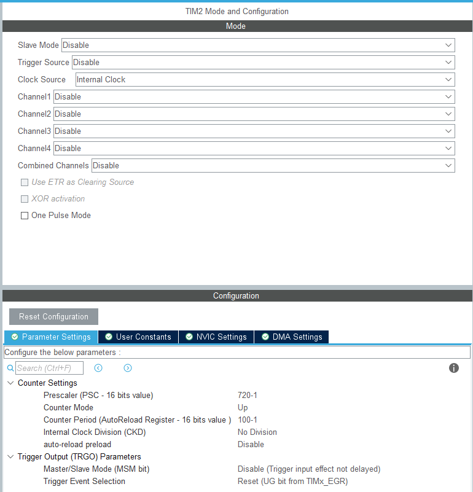
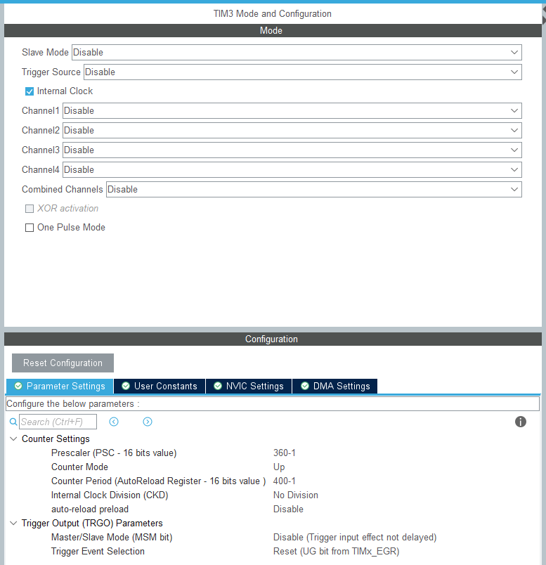
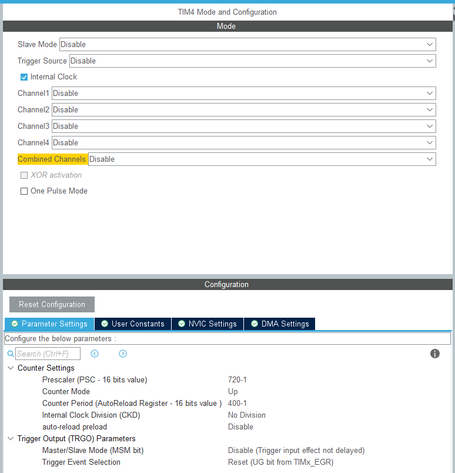
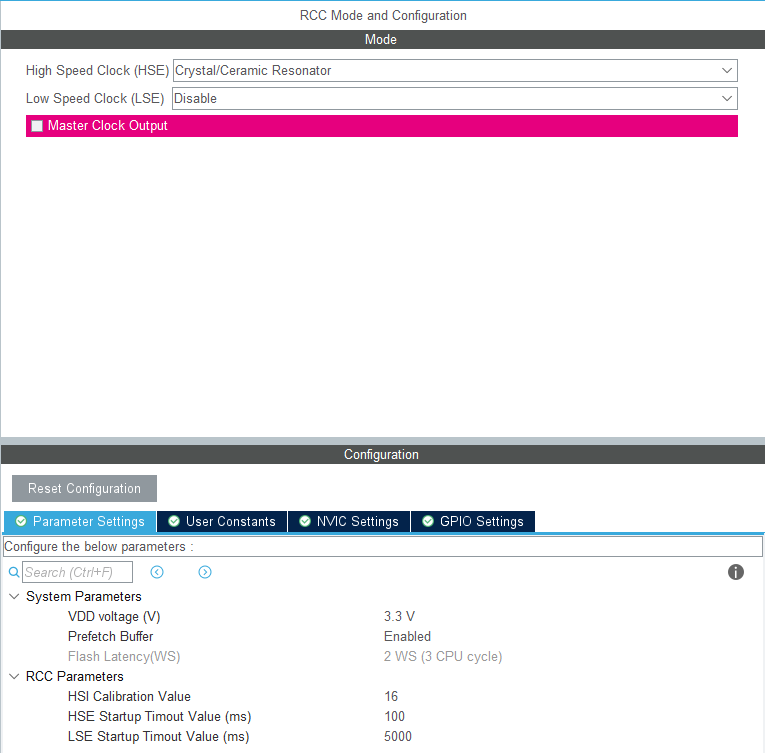
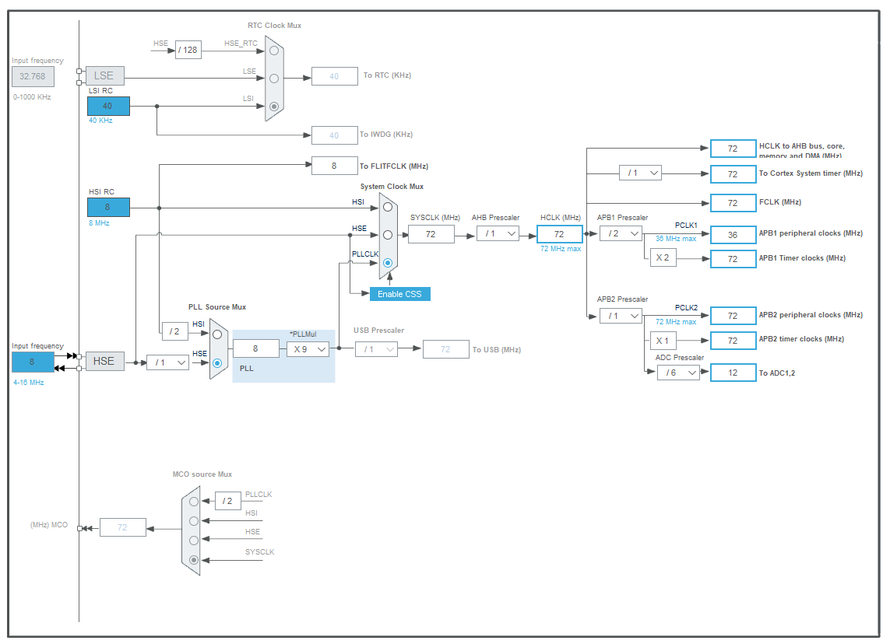

# 通用一体化关节项目GIA_Zeng

| 修订日期   | 修订内容 | 修订版本  |
| ---------- | -------- | --------- |
| 2022/10/30 | 新建文档 | Beta1.0.0 |

## 1.结构设计

## 2.硬件设计

+ MCU-STM32F103C8T6：

BOOT位设置：

LED控制灯：

+ 编码器：

AS5600-I2C读取

方向设置

+ 电源：

24V-5V

匹配电阻：

5V-3V3

+ 电流采样：

INA240A3PWR 100V/V 0.01R电阻

电流采样范围：-1.65~1.65A，匹配电机额定电流0.75A

下限 (0-1.65)/0.01/100=-1.65A

上限 (3.3-1.65)/0.01/100=1.65A

+ 驱动：

L6234D，功率偏大，下一版可以考虑换DRV8313？

+ 硬件接口：

贴片式接线端子

## 3.软件设计

+ STM32CUBEMX引脚总览：

| 引脚 | 名称      | 备注                              |
| ---- | --------- | --------------------------------- |
| PA0  | ADC1_IN0  |                                   |
| PA1  | ADC2_IN1  | 下一版本改进：一个ADC多个通道采样 |
| PA2  | USART2_TX |                                   |
| PA3  | USART2_RX |                                   |
| PA4  | OUT       | 测试用                            |
| PA8  | TIM1_CH1  | PWM-U相输出                       |
| PA9  | TIM1_CH2  | PWM-V相输出                       |
| PA10 | TIM1_CH3  | PWM-W相输出                       |
| PA11 | CAN_RX    | 待完成                            |
| PA12 | CAN_TX    | 待完成                            |
| PB6  | I2C1_SCL  |                                   |
| PB7  | I2C1_SDA  |                                   |
| PC13 | LED       |                                   |

+ STM32CUBEMX-Clock总览（暂时还没有配置CAN相关内容）：

+ NVIC：(更新CAN通讯之后可能有变化)

+ 定时器：

+ RCC

+ Clock Configuration

## 4.通讯协议

采用16Bit串行数据TTL&CAN通讯。TTL用于调参，CAN用于实时通信。详见：[通信协议说明](https://github.com/roboticszeng/GIA_ZENG/tree/main/Communication)

