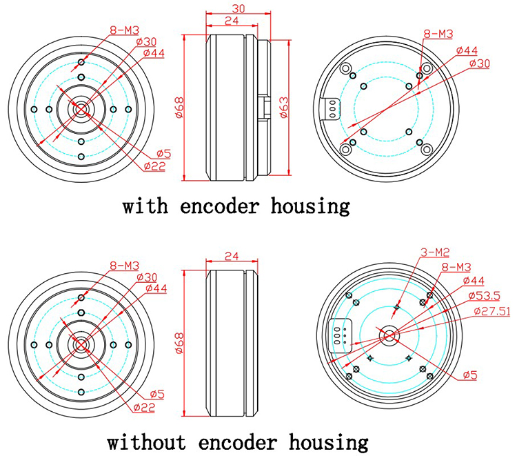

# 通用一体化关节项目GIA_Zeng

| 修订日期   | 修订内容 | 修订版本  |
| ---------- | -------- | --------- |
| 2022/10/30 | 新建文档 | Beta1.0.0 |

## 1.结构设计

## 2.硬件设计

+ MCU-STM32F103C8T6：

BOOT位设置：

LED控制灯：

+ 编码器：

AS5600-I2C读取

方向设置

+ 电源：

24V-5V

匹配电阻：

5V-3V3

+ 电流采样：

INA240A3PWR 100V/V 0.01R电阻

电流采样范围：-1.65~1.65A，匹配电机额定电流0.75A

下限 (0-1.65)/0.01/100=-1.65A

上限 (3.3-1.65)/0.01/100=1.65A

+ 驱动：

L6234D，功率偏大，下一版可以考虑换DRV8313？

+ 硬件接口：

贴片式接线端子

- 电机GB6010信息（厂商提供，待测）

[淘宝链接](https://item.taobao.com/item.htm?spm=a1z09.2.0.0.7d002e8dyVimGY&id=639378697535&_u=c239sn30f500)

主要的问题：

- 如何测定额定电流和额定扭矩？
- 转速常数12rpm/V,也即24V时转速应为30rad/s，但实际上似乎没这么大？
- 扭矩常数0.6，额定力矩和额定电流对不上
- 

## 3.软件设计

+ STM32CUBEMX引脚总览：

| 引脚 | 名称      | 备注                           |
| ---- | --------- | ------------------------------ |
| PA0  | ADC1_IN0  |                                |
| PA1  | ADC1_IN1  |                                |
| PA2  | USART2_TX |                                |
| PA3  | USART2_RX |                                |
| PA4  | SEN_DIR   | 编码器方向定义                 |
| PA5  | KEY       | ==按键输入，软件暂未实现==     |
| PA8  | TIM1_CH1  | PWM-U相输出                    |
| PA9  | TIM1_CH2  | PWM-V相输出                    |
| PA10 | TIM1_CH3  | PWM-W相输出                    |
| PA11 | CAN_RX    |                                |
| PA12 | CAN_TX    |                                |
| PB5  | SENS_OUT  | 编码器电压输出（当前版本不用） |
| PB6  | I2C1_SCL  | 编码器I2C通信                  |
| PB7  | I2C1_SDA  | 编码器I2C通信                  |
| PC13 | LED       |                                |

+ STM32CUBEMX-Clock总览：

+ NVIC：==待更新==

+ 定时器：

公式：
$$
T=(ARR+1)*(PSC+1)/f_{ck}
$$

$$
f=\frac{1}{T}
$$

$f_{ck}$单位为Hz，对于STM32F103C8T6，$f_{ck}=72\times10^6$Hz；$T$单位为s。

| 定时器 | 分频值 | 重装值 | 周期   | 频率     | 功能简介           |
| ------ | ------ | ------ | ------ | -------- | ------------------ |
| TIM1   | 3-1    | 1500-1 | 62.5us | 16kHz    | 生成PWM波&电流采样 |
| TIM2   | 300-1  | 240-1  | 1ms    | 1000Hz   | 编码器采样         |
| TIM3   | 160-1  | 72-1   | 160us  | 6.25kHz  | 电流环控制         |
| TIM4   | 160-1  | 144-1  | 320us  | 3.125kHz | 位置环&速度环控制  |

## 4.通讯协议

采用16Bit串行数据TTL&CAN通讯。TTL用于调参，CAN用于实时通信。详见：[通信协议说明](https://github.com/roboticszeng/GIA_ZENG/tree/main/Communication)

